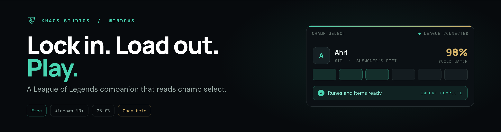

 

**[Download](https://github.com/snacbot/warden-releases/releases/latest/download/WardenSetup.exe)**
&nbsp;·&nbsp;
**[Website](https://khaosstudio.com/warden/)**
&nbsp;·&nbsp;
**[Discord](https://discord.gg/UxfhSWavbQ)**
&nbsp;·&nbsp;
**[Release notes](https://github.com/snacbot/warden-releases/releases)**

---

## What Warden is

Warden sits next to the League client and turns champ select into a build that's already loaded. It sees your champion, your role, and your queue, works out what you should be running, and puts the runes, items, and summoner spells into the client with one click. By the time the loading screen comes up you're done.

It's free, there are no ads anywhere in it, and there's no account to make. The installer is 26 MB and the app is a native Tauri build, so there's no Overwolf layer sitting underneath it and no second launcher to babysit. It wakes up when League does and gets out of the way when you close the game.

Warden knows which mode you're in. Summoner's Rift gets a role-aware build with runes, spells, skill order, and an item path. ARAM and Arena get augment rankings next to the build, because augments are what actually decide those games. Arena in particular is the mode every other companion treats as a footnote, and it's the one we spent the most time on.

Recommendations come with their sample size and their source attached. When the data is thin, Warden says so instead of inventing a number.

## Install

1. Download [`WardenSetup.exe`](https://github.com/snacbot/warden-releases/releases/latest/download/WardenSetup.exe) from the latest release. There's also an [MSI](https://github.com/snacbot/warden-releases/releases/latest/download/Warden.msi) if you deploy that way.
2. Run it, then launch Warden alongside the League client.
3. That's the whole setup. No account, no sign-in, no config file.

Warden keeps itself current through signed update manifests, so you won't need to reinstall.

**Requires Windows 10 or later.**

## What it does

**In champ select**

- One-click or automatic import of runes, items, and summoner spells, straight into the client.
- Builds sliced by patch, rank, and role, each shown with its source and a sample-size indicator rather than a bare "highest win rate."
- Composition-aware adjustments that react to the actual enemy team: magic resist into heavy AP, armor into AD, anti-heal into sustain, with a line explaining each one.
- Pick and matchup suggestions with short reasoning attached, not a wall of stats.

**Lobby scouting**

- All ten players in Summoner's Rift and ranked: rank, win rate, most-played champions, role, recent form.
- Plain-English reads such as "one-trick" or "on a loss streak" instead of raw numbers.
- Respects streamer mode and Riot's name-visibility settings.

**Live overlay**

- Dragon, baron, and herald timers, plus jungle camp and scuttle respawns.
- Enemy summoner-spell tracking and ultimate availability estimates.
- Grievous Wounds reminders when the enemy comp calls for it.
- A damage calculator that reads your live stats: hover an item and see what your auto-attack does with it.
- Live benchmarking of your CS/min, gold/min, kill participation, and vision against your bracket.
- Minimap-anchored timers and per-portrait ult hints, all repositionable and individually toggleable.

**Arena and ARAM**

- A live eight-player, four-team Arena board.
- Per-champion best augments from real Arena match data, with reasoning for why each one is strong.
- An offered-augment picker that ranks the three you were actually given this round.

**After the game**

- Three things to work on, framed against your rank, with CS benchmarks, vision gaps, and a gold-lead timeline.
- Arena post-game with placement, augment review, and damage share.
- The same coaching for any game already in your match history.

**Profile and stats**

- Rank progression, per-champion stats, strengths and weaknesses, challenges, and full match history.
- Per-mode champion stats, tier lists, team synergies, and objective stats.
- A weekly graded dashboard that trends your performance by category.
- Optional pro and high-elo build reference, clearly labeled as such.

## Is this allowed?

Warden reads the same local League client interfaces every other companion app uses, and everything it does is something you could do by hand: read champ select, then create a rune page and an item set. It does not automate gameplay, read game memory, or touch game files. Item and rune import goes through Riot's official client API, the sanctioned path other approved tools use.

It also never overwrites anything it didn't make. Warden creates its own clearly named rune pages and item sets and leaves yours alone, so it runs fine alongside other tools.

We're not Riot and can't speak for them. The longer version of this answer, with the reasoning, is [on the site](https://khaosstudio.com/warden/are-league-companion-apps-bannable/).

## This repo

The **public release channel** for Warden: published Windows builds and the signed `latest.json` manifest the app reads to update itself. The source is private.

Warden is in open beta and is being shaped by the people running it. Bug reports and feature requests go in [Issues](https://github.com/snacbot/warden-releases/issues) or, faster, in [Discord](https://discord.gg/UxfhSWavbQ).

## More

- **Product page:** [khaosstudio.com/warden](https://khaosstudio.com/warden/)
- **How rune import works:** [khaosstudio.com/warden/how-to-import-runes](https://khaosstudio.com/warden/how-to-import-runes/)
- **ARAM and Arena builds:** [khaosstudio.com/warden/aram-arena-build-app](https://khaosstudio.com/warden/aram-arena-build-app/)
- **Running without Overwolf:** [khaosstudio.com/warden/without-overwolf](https://khaosstudio.com/warden/without-overwolf/)
- **Comparisons:** [Blitz](https://khaosstudio.com/warden/vs-blitz/), [Porofessor](https://khaosstudio.com/warden/vs-porofessor/), [Mobalytics](https://khaosstudio.com/warden/vs-mobalytics/), [op.gg](https://khaosstudio.com/warden/vs-op-gg/), or [the whole field](https://khaosstudio.com/warden/best-league-companion-apps/)
- **Studio:** [Khaos Studios](https://khaosstudio.com) · [Privacy](https://khaosstudio.com/privacy.html) · [Terms](https://khaosstudio.com/terms.html)

## License

Warden is proprietary software. Copyright 2026 Khaos Studios LLC. All rights reserved.

Warden isn't endorsed by Riot Games and doesn't reflect the views or opinions of Riot Games or anyone officially involved in producing or managing Riot Games properties. Riot Games and all associated properties are trademarks or registered trademarks of Riot Games, Inc.
